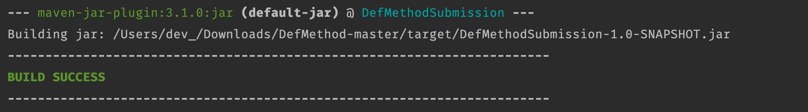
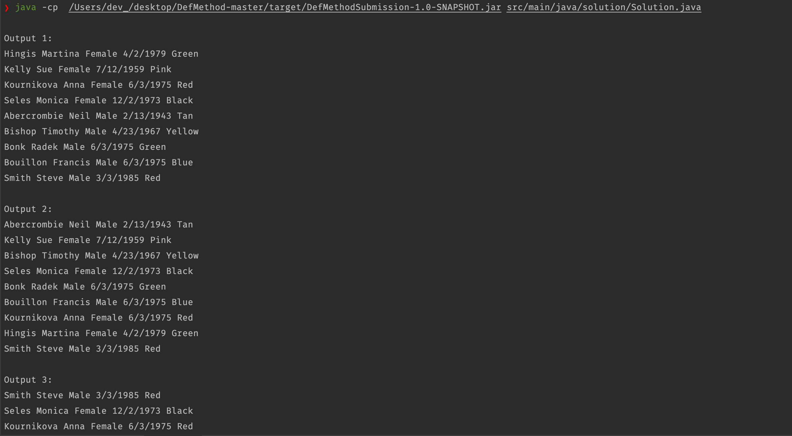

## DefMethod: Home assignment - java implementation

 #### My Approach 
      One of the goals i had for this assignment was to make the parse function as robust as possible. 
      
      Internally the parse function will generate a new person object based on the delimiter and the file being read from.

  ### Changelog ***
   - The main method has been refactored.
   - Improved sorting, functions are more autonomous.
   - Improved TDD - 6 new test cases.
   - Test functions are also improved and autonomous.
   - Updated README
 ### Prerequisites: 

     Maven 3.6.3
     Java 17.0.3-tem (support for lambda expression)

### Build
      open terminal
      unzip DefMethod_.zip
      cd path/DefMethod-master
      run mvn clean package 
      
 ### Run project from terminal
    run the following command in your dir: path/DefMethod-master

    ** note: the path will be generated after the maven build.
    
     If the path below doesn't work. 
    
     copy & paste the path generated
     
     run 
     command: java -cp/generated_path src/main/java/solution/Solution.java
     
 
   
    cd  path/DefMethod-master
    java -cp /[path]/DefMethod-master/target/DefMethodSubmission-1.0-SNAPSHOT.jar src/main/java/solution/Solution.java

### Successfully compiling and running the program
